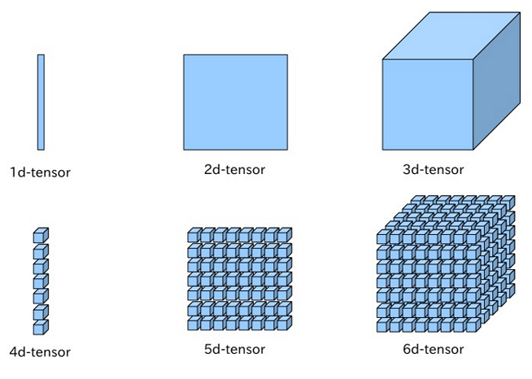
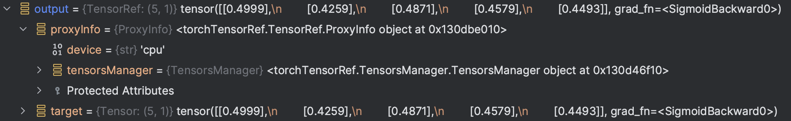
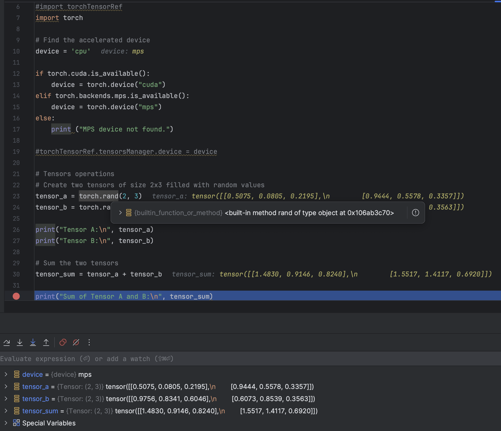
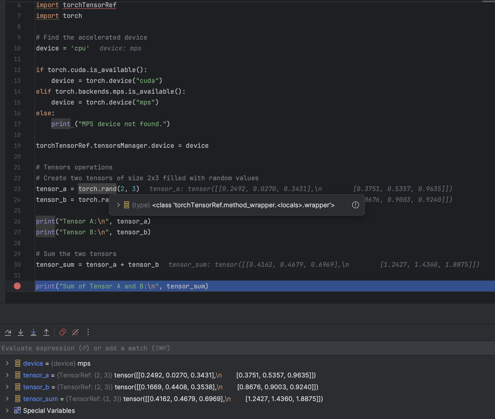
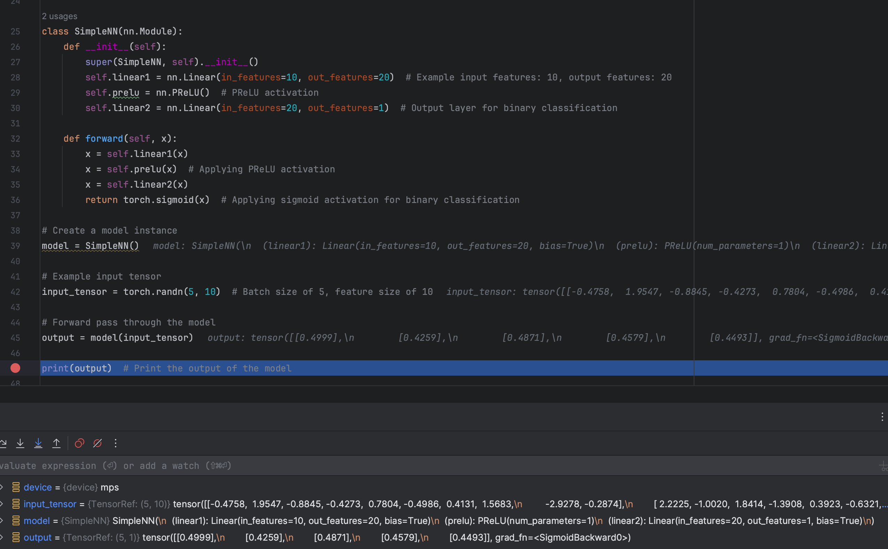

# torch.TensorRef
**Disclaimer: torch.TensorRef is an indipendent project respect than the PyTorch project.**

## Premises
Currently is possible to use deep learning models gradually more and more powerful but that requires more and more hardware resources. For novices (and not only) the costs of these hardware can be prohibitive, preventing them from studying the magical world behind the artificial intelligence. Another problem is the fact that to having reasonable training and inference times is a must to use hardware acceleration, primarily GPUs. Personally, in this moment, I have an AMD 6600 XT where, using ROCm for Linux, allows me to decimate the time necessary to inference models. But, even if the GPU is pretty powerful, the major limitation is due to the Video RAM available: only 8 GB. 

But seems possible to avoid this limitation using a trick...

## PyTorch
The most commonly used framework for deep learning is PyTorch, because due to its structure allows the programmer to handle the flow of the model down to the smallest details. Basically, PyTorch is a math framework oriented to the tensors. Tensors are multidimensional matrices used in machine learning, following several math principles, to discover patterns through multiple transformations of these tensors returning one or more final tensors representing, in several way, the classification of the inputs processed. This transformation is also guided by the "training" process, where an input in a dataset is given with the excepted output. The deep learning models learn how to predict the right outputs by manipulating the neurons' properties, like biases and weights, always under certain activation functions. A deep learning neuron is different than a biological neuron: it's more simplified to accomplish typical electronic hardware elaboration flow. 

But what's the "issue" with the VRAM usage? 



## The VRAM limitations
Today, AI hardware producer like nVidia, are creating video cards (and accellerators) with more and more GB available, typically useless for a videogamer, but very important for machine learning. But this doesn't mean that a video card is not good for machine learning only because it have no enough VRAM available. Thanks to the PyTorch structure the programmer has more control over the flow of the model, but at the same time can have some difficulties in the memory management because:

- A tensor instance can be located uniquely on a single device specified during initialization or "to" method (which creates a new different instance). 
- A math operation between tensors on different devices raise an exception blocking the flow of the model.
- Is often necessary to implement hardware acceleration directly in the model given a certain acceleration architecture (like CUDA, TPU or MPS).
- In GPU memory remains currently unused tensors in the current process due to the difficulty of handling the value of a tensor itself independently from the device where it's allocated.

The HuggingFace project, for example, provides a library called "accelerate" where you can write your model for CPU and then, the library, allows the execution on a specified device. Anyway remains some limitation, like the impossibility to manage directly the memory management strategies.

## torch.TensorRef
Here arrives torch.TensorRef. Is a python library which wrap the currently installed torch library to implement the torch.TensorRef's class TensorRef, that is obviously the main character of this project. The TensorRef is basically the "pointer" of a Tensor, independently of its device or format. 

For example, I have this tensor:

```python
import torch
hi = torch.rand(2,3) # hi is a torch.Tensor object
```

This is automatically allocated to the CPU. To allocate it on GPU you have to create a new tensor using the method `to`.

```python
hiGpu = hi.to('cuda')
```

Now we have two tensors, `hi` and `hiGpu`.

Instead, with `TensorRef`:

```python
import torchTensorRef # this module automatically injects TensorRef in torch module
import torch

# Inform the tensors manager what device do you want mainly use
torchTensorRef.tensorsManager.device = 'cuda'

hi = torch.rand(2,3) # now hi is a TensorRef object (allocated on CPU)
hi.toGPU() # now hi is allocated on GPU
print(hi) # it will be printed as torch.Tensor object
```

A `TensorRef` objects has only two attributes: `target`, the current `torch.Tensor`, and `proxyInfo`, containing the information about this TensorRef. The reason of having only two attributes is because the TensorRef tends to redirect most of the magic methods to the target `torch.Tensor`, because it aims to be the most transparent as possible and work as a proxy with the target Tensor.


*This is the inspect of a TensorRef object. The `proxyInfo.device` value is the summary of the current device of the target Tensor.*


### In practice
This is a demonstration of the working of the library in the injection process, let's start with the standard working of PyTorch:


As you can see the `torch.rand` function is the normal built-in PyTorch function, which returns a `torch.Tensor` object. In this case is retrieved the available accelerator (Metal) but is unused seeing that the device parameter is not passed.

#### TensorRef injection
Now we debug the same code importing first torchTensorRef, and setting our accelerator device in `torchTensorRef.tensorsManager` object:



At this point the torch functions appear to be wrapped by torchTensorRef module to change the behavior in the passage of arguments and in the return of the result: primarily, it wraps the Tensor in a TensorRef object (like in `torch.rand` function) but, the most important thing, it automatically handles TensorRef objects before the execution of tensors operations, and if necessary allocate it the right device. So with TensorRef is not necessary to set the device where to allocate the Tensor but it will automatically handled by the configuration in tensorsManager. But this is the basic strategy of this library: in fact torch.TensorRef aims to give to the programmer the full control of the flow of the model using different strategies.


*A more complex demonstration with a simple NN model*

## Memory management strategies
The object `torchTensorRef.tensorsManager` aims to provide to the programmer all the configurations possible to have control about the memory management strategy. The tensorsManager has also the task of tracking the TensorsRef instances across the devices. The basic strategy, the one seen in the demonstration and currently available, is the **Genoa Strategy**. The strategy is also about the selection of the device to use (in case of multiple accelerators available) in certain operations.

### The Genoa strategy
The Genoese are known for their stinginess, and Genoa's strategy works exactly like this: the allocation to the accelerator device happens suddenly before the execution of the operation and the result is immediately moved again to the CPU. This method used to have a lack of performance due to the continuing exchange of data between RAM and VRAM with subsequent bottlenecks. Anyway is the simplest way to have a rapid demonstration of the working of TensorRef and it uses as little VRAM as possible. 

### The Flow strategy
This strategy is still theoretical and has to be developed. This strategy aims to calculate in real-time, based on the VRAM available and the recurrence of use of a tensor, what tensors move back to CPU and what tensors keep in VRAM. This will be the optimal way to use TensorRef and a priority in the development of this project.

### Other strategies
Due to the potentialities of TensorRef (a topic covered in the next section), other kinds of strategies have to be considered.
- What device use: due to the management of tensors on different devices, it is possible to implement strategies and middleware that choose how to divide certain groups of recurrent operations if more accelerator devices are available.
- When moving tensors: is possible to move a tensor before the actual execution of the operation, so the data to process is already available for the processing immediately at the end of the previous operation.

## TensorRef potentialities
The concept of TensorRef was considered by the PyTorch developers, but they decided that a unique pointer per device was more optimal for a cleared code. But the TensorRef allows new horizons:

- The possibility to create promise TensorRefs, so is possible to forecast the flow of the model. This flow can help the strategy algorithm to choose what tensors allocate, when and where.
- The possibility of ignoring the device management in the flow of the model.
- The ability to control through middlewares and callbacks the flow of the model in real-time, still without requiring an implementation in the effective model.

## We want you
torch.TensorRef is in the alpha stage. The most important thing was to demonstrate that a similar concept was possible, and the Genoa strategy can provide this demonstration. The important things to develop are:

- The Flow strategy: is the strategy able to make effectively an advantage to use an accelerator with low memory available maintaining advantages compared to a CPU execution. So its development is fundamental.
- The tensorsManager structure: is important to find the best way to structure this class to provide all the functionalities needed to give to the programmer all tools necessary to obtain the best performances and control over the model. 
- Existing models testing: is important to have testers that inform the collaborators about the limitations of torch.TensorRef in the use of models not written around the library and what to implement to improve the simplicity and the powerfulness of the project.

The project is available on GitHub at the address: [https://github.com/cekkr/torch.TensorRef
](https://github.com/cekkr/torch.TensorRef)

You can also contact me through email at the address rcecchini.ds@gmail.com

Thank you for your support,<br>
Riccardo Cecchini